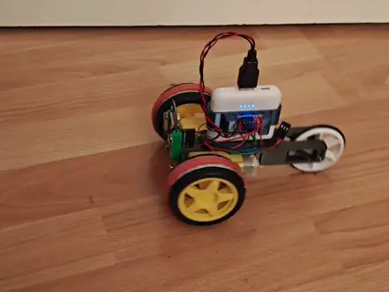
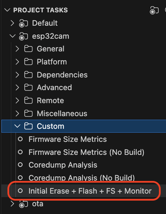
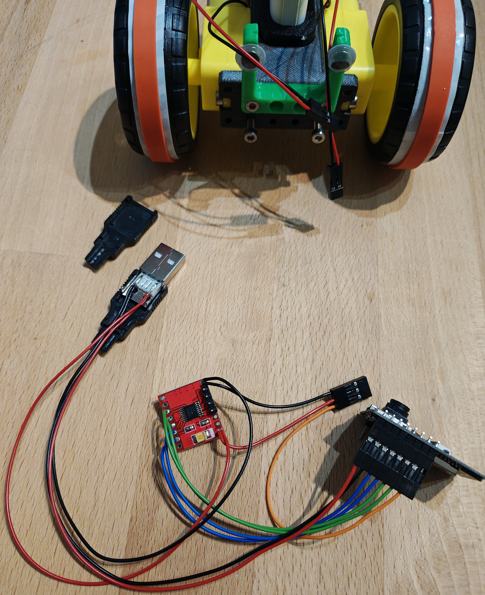
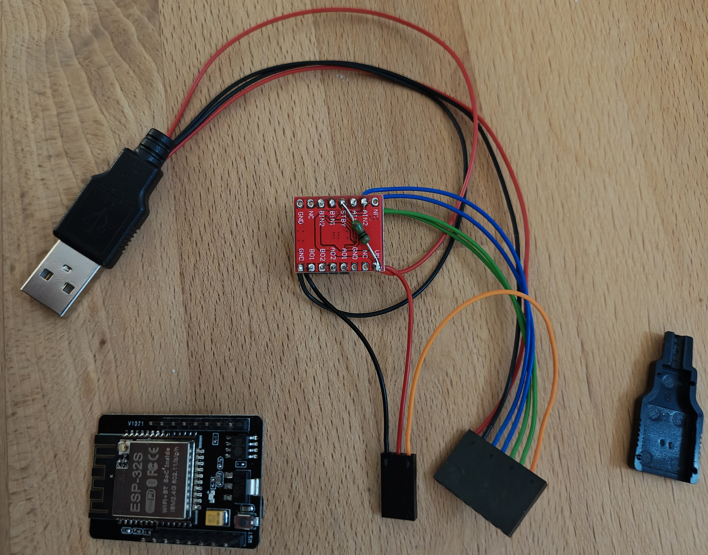
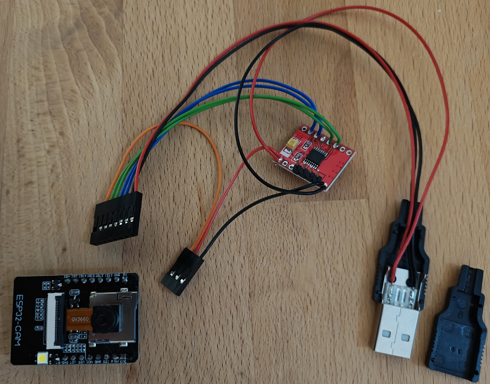

# ESP32_CAM_Auto
ESP32 Camera FPV Car - some description also on our [Hackerspace-FFM e.V. FPV-Roboter page](https://www.hackerspace-ffm.de/wiki/index.php?title=FPV-Roboter)

# Software setup
## Initial programming of ESP32 CAM Module
Connect it to USB-Serial-Board, hit `Pioarduino -> Project Tasks -> esp32cam -> Custom -> Initial Erase + Flash + FS + Monitor`. 

## Architecture infos
- LittleFS is used to store and retrieve WiFi credentials, botname and motor configs. This usually survives a FW update if LittleFS is not uploaded as well. Defaults are used, but LittleFS must be initialized. 
- Camera streams over http port 81 in MJPG mode - this guarantees lowest latency as next frame is only tranferred if current frame was delivered. Usually no significant buffering is used in browsers (this is different for eg RTSP that is why it is not used)
- Code is optimized for OV3660 cameras and support OV2640 cameras. ESP32 CAM boards have known issues with extreme WiFi lag due EMI issues with camera clock signal. We are using the following trick: Reduce external camera clock from 20Mhz to 8Mhz, but then using camera interanl PLL to get same speed again, that way we face much less interference issues.
- http deliveres index.htm and info and action point on port 80. Info streams every second info to browser like fps, but also names for sliders. action is used for controlling everything that is send from browser to the ESP (steering but also settings).
- pwmThing class encapsulates all PWM actions to control LED brightness, set motor speed and servo positions.
- Care must be taken that PWM stuff like analogWrite usually used high-speed timers, but camera clock is using low-speed timers. Arduino does not know about the already used camera timers, but as it uses high-speed timers instead there is no conflict.

# Hardware setup
## Cabling
- For full-bridge motor drivers connect inputs to 12+13 and 15+14, add connectors to the motors that you can easily swap or turn the motor lines to adjust for correct drive direction
- For 360° servos just pick two of the available pins and set them up via web interface for left and right motor
- We used an USB A plug and a power supply for suppy. In such a case wire separate cables for motors and for ESP32 beginning from USB plug to avoid issues that motor starting currents are affecting ESP32

See the following picture how we did it:

## Usable pins
Pins can be redefined via Webinterface but on ESP32 CAM only the following pins are selectable and usable: 
- -1 (if pin or function not needed)
- 2, 12, 13, 14, 15 (free for use, SD card can not be used as these are also for SD card)
- 3 (if used, serial RX is not available anymore)

The following pins can not be used even if they are available on the ESP32 CAM board:
- 0 is used for camera clock signal
- 16 is internally used for PSRAM
- 1 is used for serial TX
- 4 is controlling the white flash LED
- 33 is controlling the red internal LED (might be usable if RedLed PWMThing is connected to pin -1)

## Supported motors
Both servos and full-bridge motor drivers are supported. Currently only seperate left- and right-motor are supported (no steering servo). Servos can then be 360deg servos used as motors, adjust min/zero/max limits for servos, zero is where 360deg servos does not turn (but they are stopped if appropriate servo variant is selected anyway).

# Known issues
## It does not compile
Uninstall ESP32 core modules in Platform-IO first to force installing newest ones.

### This versions gave a running config
PACKAGES: 
 - contrib-piohome @ 3.4.4 
 - framework-arduinoespressif32 @ 3.3.7 
 - framework-arduinoespressif32-libs @ 5.5.0+sha.87912cd291 
 - tool-esp-rom-elfs @ 2024.10.11 
 - tool-esptoolpy @ 5.1.2 
 - toolchain-xtensa-esp-elf @ 14.2.0+20251107

## Connection issues
- Check Serial output for IP address and if Wifi connection worked.
- Most browsers need at least a slash at the end to not trigger the search engine, try `cambot/`first.
- Name server often have issues, mDNS is also active, try `cambot.local/`if IP can not be resolved.
- Some browsers tries always https, but only http is supported now, try `http://cambot.local`in such case.
- Last resort enter ip address in browser
- If WiFi credentials are not set, either set them via Serial terminal or connect to access point of the device, then open `http://192.168.4.1/`and set there Wifi SSID + password, then power cycle.

## FPS 
Ok, you want the picture as smooth as possible, why limit FPS then? If WiFi is too much congested, everything starts getting sluggy, especially if more than one FPV car is operated it can make sense to limit the frame rate to leave some room for other players. WiFi at 2.4 GHz can transmit around 3,000 kBytes/s (but an ESP32 max out usually already at 1,000 kBytes/s due internal limits), depending on quality settings and picture size we integrated at least 4 fpv cars in the band without issues simultaneously. Keep an eye on RSSI, if it falls below -70 dBm the WiFi bandwith starts to be limited significantly affecting also the frame rate of that vehicle.  

## Camera overheating
Especially the OV3660 moduls are working on ESP32 CAM boards, but are operated out of voltage specifications there. Therefore they are more prone to heat up - glue them with thin double sided tape to the SD card holder to give them a little more cooling surface. Camera is specified to operate with best picture quality up to 50°C, they are specified to allow operation up to 70°C, we see it often a little bit higher than that but it seems to be ok. As said, issue is that OV2640 is usually prefered over OV3660 du to better picture and speed but are more prone to overheating.